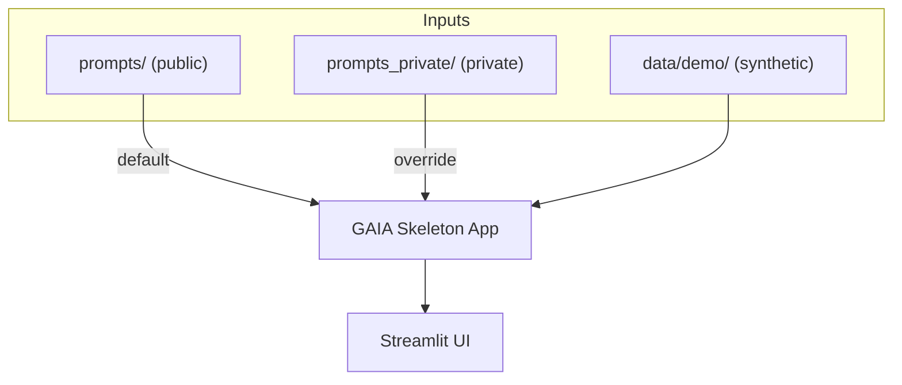

---

# 🦴 GAIA Skeleton — Public-Safe Demo

This is a **public-safe skeleton** of **GAIA (Generative AI Investment Analytics)**.
It demonstrates the architecture, UI, and workflow without exposing any private data, secrets, or proprietary prompts.

👉 Use this skeleton to explore, demo, or extend GAIA concepts. For deeper access, private demos, or discussion of GAIA’s full capabilities,
please contact **Scott Morgan** directly (smm253@gmail.com)

---

## What’s Inside

* **Synthetic Demo Data** → lives in `data/demo/`
* **Placeholder Prompts** → live in `prompts/`
* **Prompt Engineering Hooks** → real prompts should go in `prompts_private/` (gitignored, not shared)
* **Streamlit App** → a thin version of the GAIA dashboard you can run locally
* **No Secrets** → no API keys, visitor logs, or client data

---

## Project Structure

```plaintext
📁 gaia-skeleton/
 ├── app.py               ← Minimal Streamlit entrypoint
 ├── pages/               ← Simplified page stubs
 ├── utils.py             ← Demo helpers
 ├── data/
 │    └── demo/           ← Synthetic CSV/XLSX data
 ├── prompts/             ← Safe example prompts
 ├── prompts_private/     ← Your real prompts (ignored in git)
 ├── requirements.txt     ← Python deps
 └── README.md            ← This file
```

---

## Prompt Swap Architecture



> This shows how `prompts_private/` silently overrides `prompts/` when present, without exposing IP.

---

## ⚙️ Run Locally

Clone and run with Python 3.9+:

```bash
git clone https://github.com/ScottMorgan85/gaia-skeleton.git
cd gaia-skeleton
pip install -r requirements.txt
streamlit run app.py
```

App will start on: `http://localhost:8501`

---

## How To Extend

* Add your **real prompts** in `prompts_private/` with the **same filenames** as `prompts/`.
  (e.g., replace `prompts/commentary.txt` with a private version in `prompts_private/commentary.txt`).
* Replace synthetic demo CSVs in `data/demo/` with your own sample data.
* Extend `utils.py` or `pages/` for richer client/portfolio views.

---

## Why This Repo Exists

The full GAIA project integrates with **Groq-hosted Llama models**, client logs, and sensitive prompt engineering.
This skeleton strips all of that, so you can safely:

* Share with collaborators
* Write articles / blog posts
* Teach concepts like **prompt engineering secret sauce**
* Prototype new features without risk

---

## Next Steps

If you want to deploy a real GAIA instance:

* Add your **API keys** and **private prompts**
* Replace demo data with actual client/strategy inputs

---

## 📜 License

MIT — use freely, but remember: **this is a demo only**.

---

